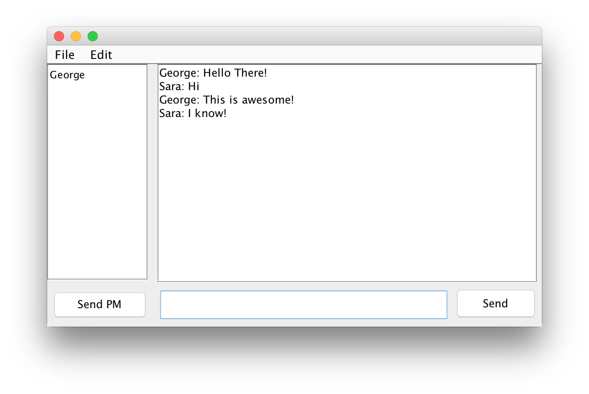
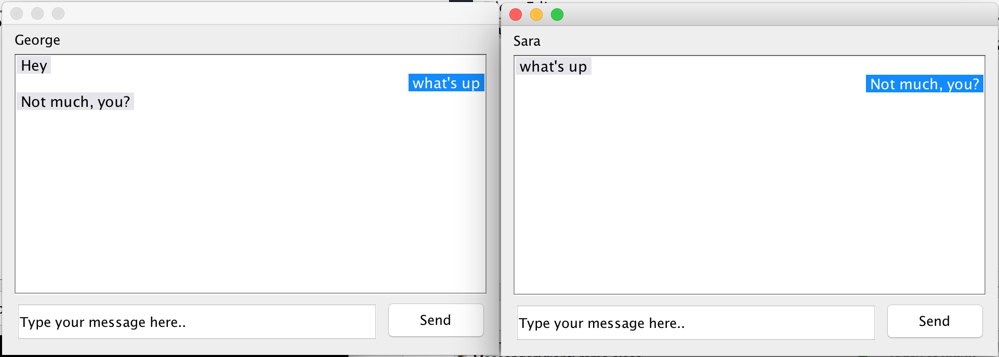

# MessengerSocketApp
Messenger App working with Sockets built in Java

## Installation 
```
javac *.java
java MessengerServer
```

and on a different terminal window (or computer on the same network)

```
java MessengerClientFrame
```
The client will ask for a display name and the server ip address (`localhost` if running both on the same machine)

## Features
- Group chat
- See the connected members
- Encrypted messages
- Private Messages between two users

## Implementation
- Uses Java Sockets for the connection
- Multithreaded Socket Server
- Uses Swing/awt for the client UI

## Screenshots
Group Chat

Private Messages

